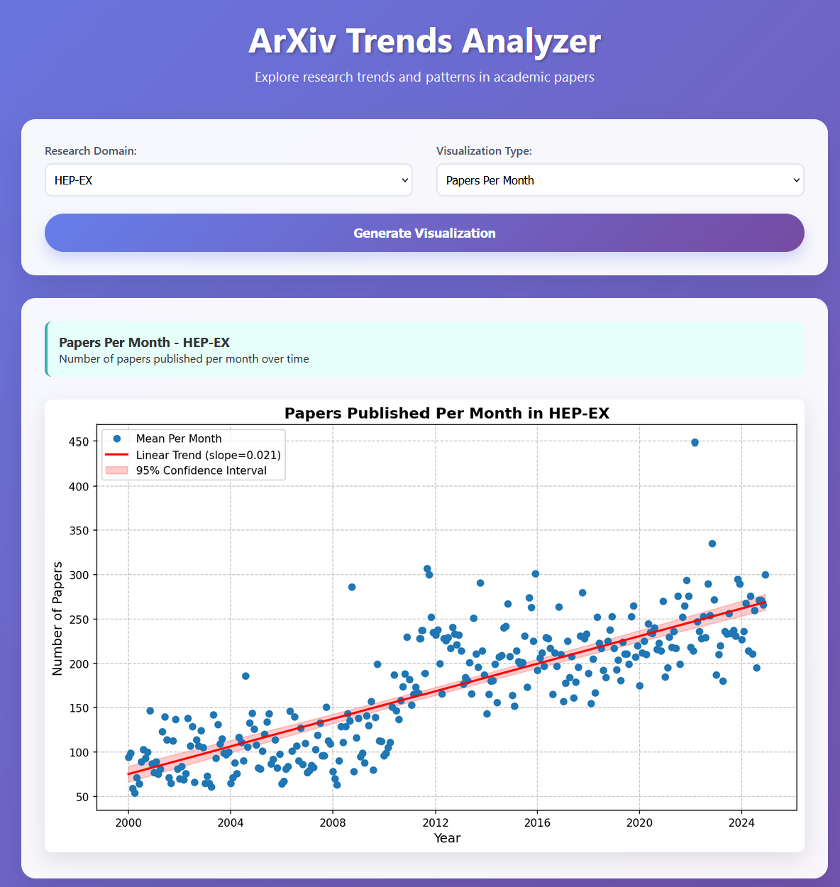

# Arxiv Research Trends Analysis


This project explores research topic evolution using data from the arXiv API. It allows users to search for keywords and visualize their frequency, emergence, and correlation over time — helping identify pivotal events, topic surges, and long-term trends in academic publishing.


---
### You can look for specific words in a given research field to identify events or trends.

 ### E.g. in 2012 the Higgs boson was discovered at CERN


 

---
### Or we can also observe the popularity growth of machine learning related topics over the years


## Getting Started


1. Clone this repository:
   ```bash
   git clone https://github.com/sabateri/arxiv-trends.git
   cd arxiv-trends
   ```

2. Run the Docker container
    ```bash
    docker build -t arxiv-app .
    docker run -p 5000:5000 arxiv-app
    ```

3.  Open your browser and navigate to http://127.0.0.1:5000/ to interact with the visualizations.


## For Development
### Prerequisites
Make sure you have ```Python 3.11.11``` installed.

Follow step 1. from the previous section  ```Getting Started```, then

3. Install the required libraries:
    ```bash
    pip install -r requirements.txt
    ```
4. If you want to download data, process it and upload to BigQuery
    ```
    python3 main.py --create-bucket
    python3 main.py --upload-gcs --process-spark --start_year 2000 --end_year 2025 --domain hep-ex
    ```
5. Running the application

    To run the analysis locally, execute the following:
    ```
    python3 app.py
    ```
    5.2
    Open your browser and navigate to http://127.0.0.1:5000/ to interact with the visualizations.

### Data Sources

Arxiv API: The data used for this analysis is fetched from the Arxiv API, which provides paper metadata such as titles, authors, and submission dates.

1. The raw data from the Arxiv API is loaded into GCS (Google Cloud Storage)
2. The data is then processed using PySpark and loaded as tables into BigQuery


### Future Improvements

- Host demo version online